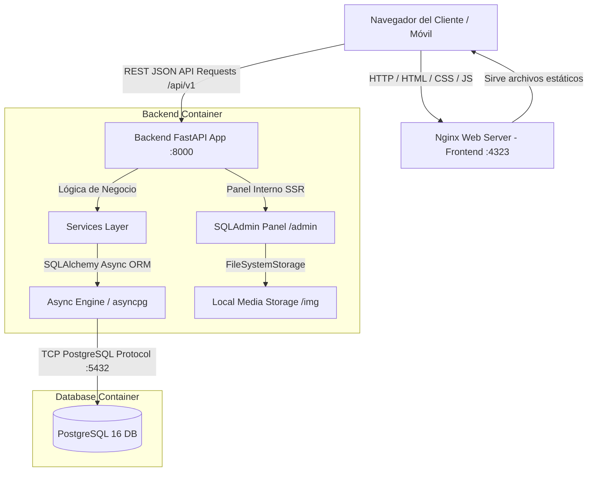
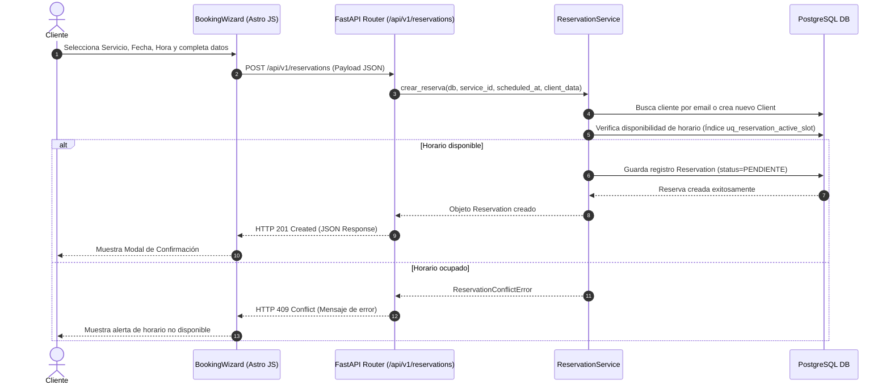
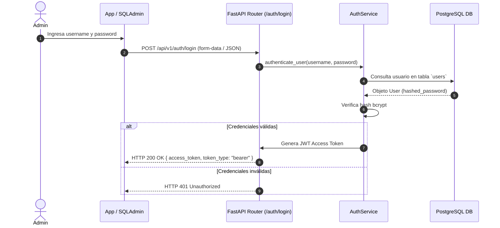

# Arquitectura del Sistema — Level Works

El sistema **Level Works** está diseñado siguiendo el patrón de **arquitectura desacoplada (API-First)**. El backend expone una API REST pura orientada a servicios JSON, mientras que el frontend es una aplicación web independiente de alto rendimiento construida con Astro.

---

## 1. Diagrama General del Sistema



---

## 2. Componentes Principales

### 2.1 Backend (FastAPI API-First)
- **Framework:** FastAPI (Python 3.12) ejecutándose sobre Uvicorn asíncrono.
- **Acceso a Datos:** SQLAlchemy 2.0 en modo asíncrono (`asyncpg`) para interactuar con la base de datos relacional PostgreSQL.
- **Contratos de API:** Pydantic v2 define y valida los esquemas DTO de entrada y salida para cada endpoint.
- **Seguridad:** Autenticación basada en JSON Web Tokens (JWT) firmados con algoritmos HS256 y hashing de contraseñas mediante `passlib` / `bcrypt`.
- **Panel Administrativo Embebido:** SQLAdmin (0.17+) provee un panel interno SSR expuesto bajo `/admin` para gestionar usuarios, clientes, servicios y reservas sin necesidad de construir un frontend administrativo independiente.

#### Capas del Backend:
```text
backend/app/
├── api/            # Layer 1: Controladores HTTP (Routing, parámetros, HTTP Responses)
├── services/       # Layer 2: Lógica de negocio reutilizable aislada de HTTP
├── schemas/        # Layer 3: Contratos DTO y esquemas de validación Pydantic
├── models/         # Layer 4: Modelos relacionales ORM (SQLAlchemy)
└── core/           # Layer 5: Infraestructura (DB Engine, JWT, Security, Storage)
```

---

### 2.2 Frontend (Astro Landing SPA)
- **Framework:** Astro (5.x / 7.x) configurado con `output: 'static'`.
- **Servidor Web:** Nginx Alpine optimizado para servir los assets estáticos HTML, CSS y JS compilados.
- **Estilos:** Tailwind CSS v4 integrado mediante el plugin oficial `@tailwindcss/vite` junto con `tw-animate-css`.
- **Interactividad Client-Side:** Sin framework pesado de UI (sin React/Vue/Svelte). Toda la interactividad client-side se logra con TypeScript modular embebido en componentes `.astro`.

#### Componente Central: `BookingWizard.astro`
El flujo de agendamiento se orquesta en un wizard interactivo en 3 pasos:
1. **Paso 1: Selección de Servicio** — Obtiene el catálogo activo desde `GET /api/v1/services`.
2. **Paso 2: Selección de Fecha y Hora** — Consulta la disponibilidad en tiempo real mediante `GET /api/v1/reservations/availability`.
3. **Paso 3: Formulario de Datos** — Recopila datos del cliente y vehículo, enviando la reserva a `POST /api/v1/reservations` y mostrando una confirmación modal tras el registro exitoso.

---

## 3. Flujos de Datos Clave

### 3.1 Flujo de Creación de Reserva (Cliente Público)



### 3.2 Flujo de Autenticación de Administrador



---

## 4. Patrones de Seguridad y Rendimiento

1. **Prevención de Doble Reserva (Race Conditions):**
   A nivel de base de datos, PostgreSQL aplica un índice parcial único (`uq_reservation_active_slot`) en `scheduled_at` para todas las reservas que no estén en estado `cancelada`. Esto garantiza consistencia atómica y previene reservas duplicadas aun bajo peticiones concurrentes.

2. **CORS Configurable:**
   El backend FastAPI valida el encabezado `Origin` contra `CORS_ORIGINS` especificado en el entorno `.env`, permitiendo peticiones cruzadas únicamente desde orígenes autorizados (ej. `http://localhost:4323`).

3. **Multi-Stage Build en Docker:**
   El contenedor del frontend utiliza una compilación de múltiples etapas en Node.js, conservando únicamente los archivos compilados en la imagen final de Nginx Alpine, reduciendo drásticamente la superficie de ataque y el peso de la imagen.
