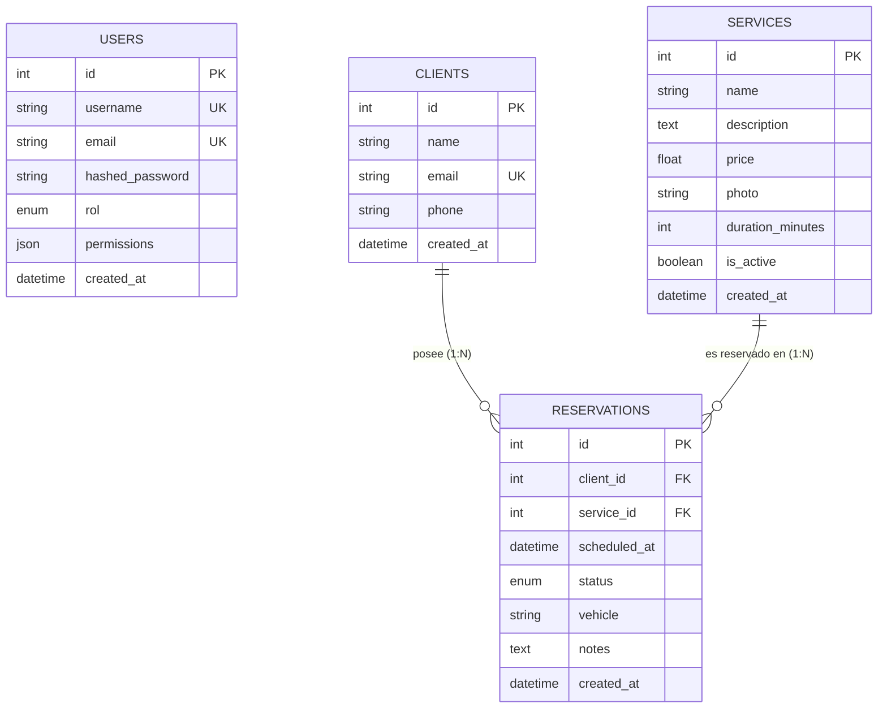

# Modelo de Base de Datos y Esquema Relacional — Level Works

El sistema utiliza **PostgreSQL 16** como motor de base de datos relacional. La interacción desde el backend se realiza de manera asíncrona mediante **SQLAlchemy 2.0 ORM** y el driver **asyncpg**.

---

## 1. Diagrama Entidad-Relación (ERD)



---

## 2. Detalle de Tablas y Esquemas

### 2.1 Tabla `users` (Usuarios Internos y Administradores)
Almacena las credenciales y niveles de acceso para el personal que opera el sistema o SQLAdmin.

| Columna | Tipo de Dato | Restricciones | Descripción |
| :--- | :--- | :--- | :--- |
| `id` | `INTEGER` | `PRIMARY KEY`, Auto-increment | Identificador único del usuario. |
| `username` | `VARCHAR(255)` | `UNIQUE`, `NOT NULL`, `INDEX` | Nombre de usuario para iniciar sesión. |
| `email` | `VARCHAR(255)` | `UNIQUE`, `NOT NULL`, `INDEX` | Correo electrónico institucional. |
| `hashed_password` | `VARCHAR(255)` | `NOT NULL` | Contraseña cifrada con algoritmo Bcrypt. |
| `rol` | `VARCHAR(50)` / `ENUM` | `NOT NULL`, Default: `user` | Rol del usuario (`admin`, `editor`, `user`). |
| `permissions` | `JSON` | `NOT NULL`, Default: `["leer"]` | Array JSON de permisos específicos (`crear`, `leer`, `actualizar`, `eliminar`). |
| `created_at` | `TIMESTAMP WITH TIME ZONE` | Default: `now()` | Fecha y hora de registro. |

---

### 2.2 Tabla `clients` (Clientes del Autolavado)
Registra los datos de contacto de las personas que han agendado una cita.

| Columna | Tipo de Dato | Restricciones | Descripción |
| :--- | :--- | :--- | :--- |
| `id` | `INTEGER` | `PRIMARY KEY`, Auto-increment | Identificador único del cliente. |
| `name` | `VARCHAR(120)` | `NOT NULL` | Nombre completo del cliente. |
| `email` | `VARCHAR(255)` | `UNIQUE`, `NOT NULL`, `INDEX` | Correo electrónico del cliente. |
| `phone` | `VARCHAR(20)` | `NOT NULL` | Número telefónico de contacto. |
| `created_at` | `TIMESTAMP WITH TIME ZONE` | Default: `utcnow()` | Fecha de registro del cliente. |

**Relaciones:**
- Tiene una relación 1 a N con `reservations` (`cascade="all, delete-orphan"`, `passive_deletes=True`).

---

### 2.3 Tabla `services` (Catálogo de Servicios)
Define la oferta de servicios del lavadero con sus precios, duraciones e imágenes.

| Columna | Tipo de Dato | Restricciones | Descripción |
| :--- | :--- | :--- | :--- |
| `id` | `INTEGER` | `PRIMARY KEY`, Auto-increment | Identificador único del servicio. |
| `name` | `VARCHAR(150)` | `NOT NULL` | Nombre del servicio (ej. "Lavado Full"). |
| `description` | `TEXT` | Nullable | Descripción detallada de lo que incluye. |
| `price` | `FLOAT` | `NOT NULL` | Precio del servicio. |
| `photo` | `VARCHAR(255)` | Nullable | Ruta relativa a la imagen del servicio subida (`/img/...`). |
| `duration_minutes` | `INTEGER` | `NOT NULL`, Default: `30` | Duración estimada del servicio en minutos. |
| `is_active` | `BOOLEAN` | `NOT NULL`, Default: `true` | Indica si está disponible para reservar. |
| `created_at` | `TIMESTAMP WITH TIME ZONE` | Default: `utcnow()` | Fecha de creación del servicio. |

---

### 2.4 Tabla `reservations` (Citas Agendadas)
Gestiona las citas programadas relacionando un cliente con un servicio.

| Columna | Tipo de Dato | Restricciones | Descripción |
| :--- | :--- | :--- | :--- |
| `id` | `INTEGER` | `PRIMARY KEY`, Auto-increment | Identificador único de la reserva. |
| `client_id` | `INTEGER` | `FK(clients.id ON DELETE CASCADE)`, `NOT NULL` | ID del cliente que reserva. |
| `service_id` | `INTEGER` | `FK(services.id ON DELETE CASCADE)`, `NOT NULL` | ID del servicio contratado. |
| `scheduled_at` | `TIMESTAMP WITH TIME ZONE` | `NOT NULL`, `INDEX` | Fecha y hora exacta agendada. |
| `status` | `VARCHAR(50)` / `ENUM` | `NOT NULL`, Default: `pendiente` | Estado de la cita (`pendiente`, `confirmada`, `en_progreso`, `completada`, `cancelada`). |
| `vehicle` | `VARCHAR(150)` | Nullable | Modelo, marca o patente del vehículo. |
| `notes` | `TEXT` | Nullable | Notas adicionales del cliente. |
| `created_at` | `TIMESTAMP WITH TIME ZONE` | Default: `now()` | Fecha y hora en que se creó la reserva. |

---

## 3. Índices Especiales y Garantía de Consistencia

### Índice Único Condicional (Prevención de Solapamientos)
Para evitar que dos clientes reserven el mismo horario exacto simultáneamente, la tabla `reservations` incluye un **índice parcial único** sobre la columna `scheduled_at`:

```sql
CREATE UNIQUE INDEX uq_reservation_active_slot 
ON reservations (scheduled_at) 
WHERE status != 'cancelada';
```

- **Comportamiento:** Impide insertar dos registros con el mismo `scheduled_at` activo. Si una reserva es en estado `cancelada`, libera automáticamente ese horario para que pueda ser agendado por otro cliente.

---

## 4. Inicialización de la Base de Datos

En el arranque del contenedor de FastAPI, la función `init_db()` definida en `app/core/db/database.py` verifica y crea automáticamente todas las tablas relacionales registradas en `Base.metadata`:

```python
async def init_db():
    async with engine.begin() as conn:
        await conn.run_sync(Base.metadata.create_all)
```

---

## 5. Comandos Útiles de PostgreSQL (`psql`)

Conéctese a la base de datos dentro del contenedor en ejecución:

```bash
docker exec -it levelworks-db-1 psql -U postgres -d levelworks_db
```

Comandos más comunes:
- `\dt` — Listar todas las tablas.
- `\d reservations` — Inspeccionar columnas, llaves primarias, foráneas e índices de la tabla de reservas.
- `SELECT id, name, email FROM clients;` — Consultar clientes registrados.
- `SELECT r.id, c.name, s.name, r.scheduled_at, r.status FROM reservations r JOIN clients c ON r.client_id = c.id JOIN services s ON r.service_id = s.id;` — Vista consolidada de citas.
